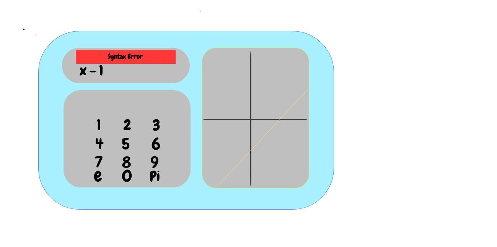

# MauriGraphingCalculator
Mauri's Online Graphing Calculator (React/Redux based)

## Installation & Running
git assumed... 
npm and/or yarn should also be present...

### Git

Clone this Repository :

```
git clone git@github.com:superMauri82/MauriGraphingCalculator.git$ 
```

### Node 
Install Dependencies:

```
$ npm install
```

Start Browser App

```
$ npm start
```

### Yarn 
Install Dependencies:

```
$ yarn install
```

Start Browser App

```
$ yarn start
```

## Running Tests
### Node
```
$ npm test
```
### Yarn
```
$ yarn test
```

## Visual Draft for App
We're heading towards something like this...



## Rationale for Dependencies

* [RxJS](https://rxjs-dev.firebaseapp.com/)
- Declarative control for async event sources 
- Same syntax for all async sources (instead of dealing with callbacks, promises, deferred's, event-emiter, and so on...) 
- Functional Paradigm Approach

* [D3JS](https://d3js.org)
- Expressive data managed documents
- Smooth integration with React

* [redux](https://github.com/reduxjs/react-re)
- The De Facto State Management Library for React (over other Flux implementations)

* [redux-thunk](https://github.com/reduxjs/redux-thunk)
- Middleware fine-grained control
- Async Actions 

* [enzyme](https://github.com/airbnb/enzyme)
- Easy to use test functionalities
- Not need for DOM (or any other rendering) environment
- Big Adoption and very well supported

* [expect](https://devhints.io/expectjs)
- Minimalist test framework
